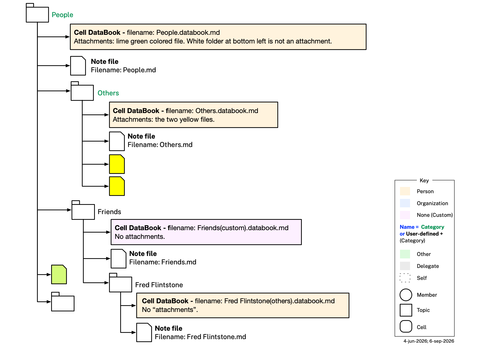

# Cellula App Behavior

This file continues [README.md](README.md) and [EXAMPLE.md](EXAMPLE.md), which describe the Category, Cell, Graph, Persona, Organization, and Agent ontologies and illustrate them with a worked example. This file documents how the app behaves *on top of* that data — cell lifecycle, storage, sharing, permissions, naming/renaming, how a cell maps onto an actual filesystem folder, and what happens when a shared cell arrives somewhere new. Nothing in this file changes any `.ttl` file or DataBook triple — every rule here is app-level behavior, not an ontology rule.

## Cell Storage

Cells are stored on the user's device(s) or, for organizations, on Personal Data Network (PDN) nodes hosted by that organization. No cell is ever stored by any cloud provider, or any third party of any kind, including The Mee Foundation. When a cell is shared, changes to its contents — including its own name, for a single-member cell or a cell with three or more members, or a two-member cell that is also `c:TopicCell` — propagate to every member over the PDN; see [Naming, Renaming, and Sharing](#naming-renaming-and-sharing) below for what stays independent per member instead.

### Filesystem Persistence

A folder is a **cell** exactly when it holds one **cell DataBook** (see [Representative Cells](README.md#representative-cells) in README.md) directly inside it, whose filename's `<local>` segment is an exact copy of the folder's own name — that single file alone marks the folder as a cell. A folder without a matching cell DataBook is simply a **regular filesystem folder**, not a cell — even if it contains nested cells of its own further down. A folder can never hold more than one cell DataBook, because a `c:Cell` is, by definition, self-contained, and letting two cells share a folder would risk a single file in that folder becoming ambiguously part of both.

A cell's DataBook may carry a `c:category` value, asserted as `mia.category` in its own YAML front matter. When present, it records the category concept — a `skos:Concept` in `cat:CategoryScheme`, always ultimately reachable from `cat:Person` or `cat:Organization` via `skos:broader` — the cell was originally instantiated from; this value is fixed at that point, not re-derived from the cell's folder's current name, so the folder can be freely renamed or moved without needing to update it. There are accordingly **three category types**, and the diagram below colors each cell's own DataBook box fill by which one it is: **Person** (tan, category reachable from `cat:Person`), **Organization** (light blue, category reachable from `cat:Organization`), and **Custom** (purple, no `c:category` at all — a cell the user created without picking any existing category concept). Custom is identified precisely, not by judgment call: the cell's DataBook filename carries the literal `(custom)` disambiguator in place of a category-derived `<catType>` (e.g. `Friends(custom).databook.md` — see the [Cell DataBook Filename Convention](CLAUDE.md#cell-databook-filename-convention) in CLAUDE.md).

A cell's own **name** — its filesystem folder's own name — is a separate, purely display-level choice, independent of the above: when the cell does have a category, the name may be copied verbatim from that category's own `skos:prefLabel` (e.g. a cell named "Others" whose category is `cat:Others`), or the user may give it a different name entirely (e.g. a cell named "Bob Johnson" whose category is still `cat:Others`). This name is recorded in the cell DataBook's own `title:` YAML field, which always equals the folder's own name verbatim (same case, spacing, and punctuation) and is kept in sync with it — renaming the folder means updating `title:` to match, not the other way around; `title:` is never an independent override of the folder's name. For a single-member cell or a cell with three or more members — or a two-member cell that is also `c:TopicCell` — this name is part of the cell's own shared content: it is kept in sync and identical across every member's copy, exactly like its graphs, files, its note (a note's own text, including any links it contains, but not necessarily the resolvability of a link pointing outside the cell — see the folder note description below), chat, `c:category`, and every other field in its DataBook (see [Introduction to Cells](README.md#introduction-to-cells) in README.md). What stays independent per member is only their own tree *position* for the cell — the parent it's nested under, and so that parent's own name — since a cell carries no property recording its own tree position at all. A bare two-member cell (not also `c:TopicCell`) is the one exception: there, the name itself is also independent per member, alongside tree position, rather than shared — see [Naming, Renaming, and Sharing](#naming-renaming-and-sharing) below for both this exception and how the app keeps a shared name unique within each member's own tree. The diagram renders this in the folder-name text color — **green** ("Predefined folder name") when the name matches the category's label verbatim, plain **black** ("User-defined folder name") when the user has customized it. This text color is unrelated to the DataBook box's fill color above — a cell can be tan-filled (Person) with black text (e.g. "Bob Johnson"), light-blue-filled (Organization) with black text, or purple-filled (Custom, no category at all) with black text — a Custom cell's name has no label to possibly match, so it is always black text too, never green.

- Every plain file found directly inside a cell's own folder is that cell's own content — its **attachments**, shown in the app's **Attachments tab** — and travels with the cell when it's shared. Attachments are flat: no subfolder is ever counted as one. A subfolder found inside a cell's own folder is always either (a) a **descendant cell** (i.e. holds its own cell DataBook) — a separate node in the tree, never counted as part of its ancestor's content even though it physically sits inside the ancestor's folder — or (b) a bare pass-through directory with no DataBook of its own, existing only to reach a descendant cell nested deeper still (see integrity.md's Check 11); neither kind ever appears in the Attachments tab. On narrow/mobile layouts the tab shows only its 📎 icon, with no text label, since "Attachments" doesn't fit.
- One special file is the cell's **cell DataBook** (a `.databook.md` file with `type: cell-databook`) — see above for why a folder can never hold more than one. A cell DataBook's *filename* matches its own folder's name verbatim, with each space replaced by a hyphen (spaces are illegal inside a raw Turtle IRI), and its `title:` field is exactly the folder's own name — the cell's name — updated whenever the folder is renamed. Its `id`, by contrast, is a flat, opaque `cell-<NN>` value independent of the folder name (see integrity.md's Check 9), the same pattern graph ids already use.
- Another special file acts as the cell's **note**, shown in the app's Note tab. A cell has exactly one note, never more — this so-called *folder note* is stored as a single file named `X.md` inside the `X` folder, and a folder can hold no second `.md` file playing this role. Using the same name as the folder matches the convention used by PKM (Personal Knowledge Management) tools such as Obsidian (using the Folder Notes plugin), Logseq, Foam and others — including the same freeform, vault-wide linking these tools support: a folder note may link to any other note anywhere in the user's tree of cells, not just within its own cell. Once a link's target has actually been instantiated as a cell (see [Wikilink-Triggered Cell Creation](#wikilink-triggered-cell-creation) below for the one case where it hasn't been yet), the link resolves by that target cell's own stable id — not by matching its display text. That id must actually be globally unique across every user's independent tree, not merely unique within one person's own tree: the small sequential `cell-<NN>` convention this repo's own example data uses (integrity.md's Check 9) is deliberately simple for one worked example living entirely under a single shared example domain, and was never meant to stay unique once real cells belong to many different users' independent instances. A real cell's id therefore needs actual entropy: a random (v4) UUID, generated locally by the creating device/app at the moment of cell creation, with no central coordination or registry of any kind — consistent with [Cell Storage](#cell-storage) above (no cell, and nothing about it, is ever held by a cloud provider or third party) and with `:Self`'s own purely-local identifier convention (see CLAUDE.md's [`:Self` IRI convention](CLAUDE.md#key-architectural-patterns)). A random UUID carries no embedded metadata — unlike a time-ordered (v7) UUID, which would leak a cell's creation time to anyone who later sees its id, including a peer the cell gets shared with. This keeps the same flat, opaque shape Check 9 already establishes (never derived from the cell's own name or category). Concretely, a resolved link is written using the alias syntax these same PKM tools already support — `[[7f3a9c2e-…|foo]]`, id before the pipe, display text after — rather than inventing new syntax; an unresolved link with no target yet (see below) is simply `[[foo]]`, no pipe at all. A link's own display text travels with the cell's note when the cell is shared, but resolution never falls back to text-matching. This matters because cell names are only unique among siblings, not globally (see [Naming, Renaming, and Sharing](#naming-renaming-and-sharing) below) — a recipient's own tree can easily contain an unrelated cell that happens to share a display name with the intended target, and id-based resolution is what keeps a link from ever silently jumping to that wrong cell instead. What id-based resolution can't fix is the linked-to cell itself not traveling with the note: if the target lies outside this cell's own boundary (i.e. it isn't part of this cell's own Attachments-tab content or its own folder note) and the recipient doesn't independently have a cell carrying that id — because it was never shared with them, or they organize their tree completely differently — the link simply won't resolve on their side; it fails closed (inert, shown as unresolved) rather than open (silently pointing somewhere else). This is an accepted limitation of cross-cell linking, not a defect.

## Cell Management

This section is about how the app manages a **cell** specifically — its lifecycle, membership, permissions, naming, and what happens when one is shared.

### Lazy Instantiation

Cells for most category concepts are not pre-created ahead of time. A cell is not created until the user wants one. When a cell matching a templated concept (one for which some `c:TemplateCell` carries a matching `c:category` value) is first created, the app clones that `c:TemplateCell` into the new cell — real content later filed under it is validated against that template's own `c:memberGraphShape`/`c:topicGraphShape` value(s), found by the same `c:category` match rather than copied onto the new cell (content filed as a `c:member` graph is validated against `c:memberGraphShape`, content filed as a `c:topic` graph against `c:topicGraphShape` instead) — and the clone is given real member-classified content — typed `c:MemberCell` — rather than staying purely a template. If the template's own `c:isTopicCell` value is `true` (15 of the 102 templates, e.g. `cat:MedicalAppointment`'s, `cat:PetsMedical`'s, `cat:Companies`'s, and `cat:Home`'s — plus 3 more, e.g. `cat:HealthWellness`'s, whose `c:topic` content is a bare third-party-reference label rather than a specific document type), the clone is also typed `c:TopicCell` from the start, since a real cell of that category always ends up carrying a `c:topic` value beyond its own `c:member` baseline.

If the user instead creates a cell with **no category** selected at all (the Custom/UserDefined case, identified by its cell-databook filename's `(custom)` disambiguator), there is no `c:category` value to drive the usual reverse lookup, so this one case falls back to a different, fixed template instead: `ctpl:UserDefinedTemplateCell` (`cat-templates.ttl`) — the one `c:TemplateCell` carrying no `c:category` value at all, found as that unique category-less template rather than by matching a category. It carries only `c:memberGraphShape pshapes:ContactInfoShape` (no `c:topicGraphShape`, `c:isTopicCell false`) — a Custom cell has no document type or topic content of its own, only ever a business-card view of its member(s).

When a member then actually fills in that cell's `c:member`/`c:topic` graph, the app also stamps the new graph's own `c:template` value from that same lookup, using whichever of the two shape properties matches the list the new graph belongs to — the cell's `c:category` → its `c:TemplateCell` → that template's `c:memberGraphShape` (for a `c:member` graph) or `c:topicGraphShape` (for a `c:topic` graph) → that shape's own CURIE, copied directly, since `c:template`'s range is `sh:NodeShape` (`cell.ttl`), the same range `c:memberGraphShape`/`c:topicGraphShape` already carry — there is no separate label to resolve. **This mapping is unconditional**: whenever a `c:TemplateCell` of category X carries a `c:memberGraphShape` value, every real cell of category X must have its `c:member` graph(s) carry the matching `c:template` value too, with no exception for which shape it happens to be. For example, a `cat:Passport` cell's sole `c:topic` graph → `ctpl:PassportTemplateCell` → `c:topicGraphShape idocshapes:PassportShape` → the graph's own `c:template` is stamped `idocshapes:PassportShape` directly — integrity.md's Check 26 separately verifies that shape's own `sh:targetClass` (`idoc:Passport`) is asserted via `rdf:type` on the graph's own new document individual; Check 27 verifies the `template:` value itself against the cell's `TemplateCell`. Every one of the 102 templates in `cat-templates.ttl` uses `pshapes:ContactInfoShape` as its own `c:memberGraphShape` (a `c:member` graph is always validated as a basic business-card profile, regardless of category, while any category-specific content lives in `c:topic` instead), so every real `c:member` graph's `c:template` is likewise stamped `pshapes:ContactInfoShape` uniformly — even though that shape's own `sh:targetClass` is the broad `persona:Person` rather than a narrow reified document class, since it validates the graph's own subject individual in place rather than a separate reified document (integrity.md's Check 26 carves this one shape out as its sole exemption from the rdf:type-matching rule, since a `c:member` stub graph legitimately need carry no `persona:Person` individual at all — e.g. an organization's own self-claimed member stub). Every `category.ttl` concept except the two SKOS top concepts `cat:Person`/`cat:Organization` themselves now has a matching `c:TemplateCell` (integrity.md's Check 29 — no real cell is ever categorized as bare Person/Organization), so the reverse `c:category` → `c:TemplateCell` → `c:memberGraphShape` lookup above covers every real `c:member` graph without exception, including Alice's own business card (`cat:Employees` → `ctpl:EmployeesTemplateCell`) — there is no longer a live case of a ContactInfo graph created with no cell-level template lookup at all.

### Number of Members

A cell can have just one member (the user) or several. We don't yet know how many members a cell can support, but the number is almost surely well under 100. An invited AI agent (`a:Agent`, see [Agent Collaboration](#agent-collaboration) below) is a real member too, and counts toward this same tally — inviting one raises a single-member cell to a two-member cell, exactly as inviting a human would.

### Permissions

Cell-level capabilities are governed by two independent axes: **ownership** (`c:owner`, cell.ttl — owner vs. regular member) and **identity type** (human, agent, or organization). A cell's creator (`c:creator`) is always its initial, and until any promotion its sole, owner; any current owner may promote any other current regular member of `p:Person`/`o:Organization` identity — never an `a:Agent`, which can never hold the owner role, mirroring `c:creator`'s own exclusion of agents — to owner, at which point that member's capabilities change as shown below; there is no mechanism to demote an owner back to regular-member status once promoted. Below, **Owner** covers any member (human or organization) currently holding that role, while **Human**/**Organization** cover a member of that identity type who is not (currently) an owner; an invited **Agent** is always a non-owner. A single-member cell has only its creator, who is trivially its sole owner — the owner/regular-member distinction only becomes observable once a cell gains a second member. There is no separate comment-only guest tier — every member, of any identity type, has exactly the same read/write access as any other member of the same ownership status; only ownership (not an invite-time choice) determines whether a member can edit the note directly or can only comment on it.

| Capability | Owner | Human | Agent | Organization |
|---|---|---|---|---|
| Create cell | yes | yes | no | yes |
| Invite member | yes | yes | no | no |
| Uninvite member | yes | yes | n/a | n/a |
| Rename cell | yes | yes | yes | yes |
| Graph claims CRUD | yes | yes | yes | yes |
| Delete cell locally | yes | yes | yes | yes |
| Delete cell globally | no | no | no | no |
| Out-of-cell comms | yes | yes | no | no |
| Add attachments | yes | yes | yes | yes |
| Edit own attachments | yes | yes | yes | yes |
| Delete own attachments | yes | yes | yes | yes |
| Delete another member's claim or attachment | yes | no | no | no |
| Promote member to owner | yes | no | no | no |
| Edit note directly | yes | no | no | no |
| Add note comment / suggested edit | yes | yes | yes | yes |
| Accept or reject suggested edit | yes | no | no | no |

- **Owner** — a member (`p:Person` or `o:Organization`, never an `a:Agent`) currently holding the owner role via `c:owner`. The creator immediately becomes the cell's first (and initially sole) owner.
- **Human** — a human member (`p:Person`) who is not currently an owner.
- **Organization** — an organization member (`o:Organization`) who is not currently an owner.
- **Invite member** — permission to invite a person, agent (of themselves), or an organization to a cell of which they are already a member.
- **Uninvite member** — permission to remove a cell member whom this member originally invited.
- **Rename cell** — see [Naming, Renaming, and Sharing](#naming-renaming-and-sharing) below for the full rule, including the bare two-member-cell exception where the name is independent per member rather than shared. Renaming is never gated by ownership.
- **Graph claims CRUD** — create/read/update/delete claims as claimant, scoped to the graphs that member or agent itself claims (see [Agent Collaboration](#agent-collaboration) and [Integrations](#integrations) for how this applies to an invited agent).
- **Delete cell locally** — removes the cell from this member's own tree only, not from any other member's copy.
- **Delete cell globally** — no role can do this; consistent with [Cell Storage](#cell-storage) above, no cell is ever held centrally, so there's no single shared copy to delete for everyone.
- **Out-of-cell comms** — permission to communicate out-of-band of the cell's chat (e.g. sending an email) with other cell members, using contact information discovered in the cell.
- **Delete another member's claim or attachment** — permission to delete a graph claim or attachment that a different member created or claims, not just one's own (contrast Graph claims CRUD/Delete own attachments above, both scoped to a member's own content) — restricted to owners.
- **Promote member to owner** — permission to add a current regular member (a `p:Person` or `o:Organization`, never an `a:Agent`) to `c:owner` — restricted to owners; there is no corresponding capability to demote an owner.
- **Edit note directly** — commit a change straight to the note's text, with no review step — restricted to owners; a non-owner member of any identity type can only add a comment or suggested edit instead (see below).
- **Add note comment / suggested edit** — attach a margin comment, or propose an inline text change shown in the proposing member's own color and tagged with their name, without altering the committed text.
- **Accept or reject suggested edit** — fold a proposed inline change into the committed note text, or discard it — restricted to owners.

### Naming, Renaming, and Sharing

For a single-member cell or a cell with three or more members — or a two-member cell that is also typed `c:TopicCell` — any member of the cell — not just its creator or another owner — can rename it, and the new name propagates to every member: renaming is never gated by ownership, unlike direct note edits and other-member claim/attachment deletion (see [Permissions](#permissions) above). Files and chat likewise stay freely editable by every member regardless of ownership status. This mirrors how **Slack** and **Notion** handle renaming by default: any member/editor can rename a channel or page, and the new name propagates to everyone. It's a deliberate contrast with **Microsoft Teams** (channel owners only, by default), **Discord**, and **GitHub**, which restrict renaming to a privileged admin/Manage-Channels/owner role — a distinction the app's cell model doesn't have to begin with. A bare two-member cell — one that is *not* also `c:TopicCell` — does *not* follow this rule — see the exception below.

A cell's name must be unique among its sibling cells — the cells directly nested under the same parent. When a user renames a cell — e.g. to give it a name of its own choosing, different from its category's label, the same convention followed by other PKM tools — to a name that already belongs to one of its siblings, the app doesn't prompt or reject the input: it silently appends the next available integer suffix (`"1"`, `"2"`, ...) to make the name unique. The same rule applies when creating a brand-new cell whose default name (e.g. copied verbatim from its category's own label) would otherwise collide with an existing sibling.

This same uniqueness rule applies on **receipt** of a shared cell — for two-member cells and cells with three or more members alike — and, once a bare two-member cell's name goes independent per member (see the exception below), on every later rename by either member too: if the incoming or renamed name collides with a cell the recipient already has at that position in their own tree, the app appends the next available suffix to it rather than overwriting the existing cell or rejecting the incoming/renamed one.

**Exception: bare two-member cells (not also `c:TopicCell`).** A two-member cell's name is never shared, synced content between its two members, in contradiction to the general rule above — each member is independently responsible for the name on their own side — but *only* when that cell is not also typed `c:TopicCell`. This is because a bare two-member cell is an asymmetric dyad about the relationship *between* its own two members: each member's name for it naturally reflects their own perspective on the *other* party, and there's no single name that fits both (e.g. Alice's cell with Bob, below). A two-member cell that is also `c:TopicCell`, by contrast, is about a third party neither member's own perspective differs on — its derived subject (see README.md's [Cell Ontology](README.md#cell-ontology) section) is the same graph-linked subject regardless of which member is looking, so there's no asymmetry to preserve, and it follows the general shared-name rule above instead, exactly like a cell with three or more members (a genuine group identity with no single "other side" to name from either). For example, the `Medical Appointment` cell Alice shares with her husband Dave — a two-member `c:TopicCell` cell whose `c:topic` link is their daughter Sophia — has one shared name kept in sync on both sides, renamable by either Alice or Dave. Their `Sophia Walker` cell (see EXAMPLE.md's [Taking Care of Sophia](EXAMPLE.md#taking-care-of-sophia)) has the same shape and follows the same rule.

For a bare two-member cell, the creator's name for their own copy is simply whatever they set it to — chosen and renamed exactly as for any other cell, subject only to the sibling-uniqueness rule above, but never propagated to the recipient's copy.

At **first-time receipt** of a bare two-member cell — the recipient self-evidently did not create it, they're joining one already created — the app does not just adopt the creator's name as shared content. Instead, once, at that first receipt, it analyzes the `c:member` graph(s) belonging to the cell's creator/sender member and auto-generates a name for the cell from that analysis. (The sender's own choice of name for their copy is naturally centered on their own perspective, so blindly reusing it verbatim on the recipient's side would be a poor fit; analyzing the sender's own member graphs lets the recipient's app derive a name that makes sense from its own side instead.) This auto-generated name is subject to the same sibling-uniqueness suffixing described above.

For example, Alice creates a bare two-member cell about her relationship with Bob and names it "Bob" on her own side, then shares it with Bob. On first receipt, Bob's app doesn't just copy "Bob" — that's Alice's name for *him*, not a name that makes sense in Bob's own tree. Instead it scans the cell's `c:member` graph(s) belonging to Alice, finds a graph about Alice herself, extracts her given name, and names the cell "Alice" on Bob's side instead.

From that point on, both the creator's and the recipient's names for their own copies may be freely renamed at any time, exactly like a single-member cell's name — but such a rename stays purely local to the renaming member's own tree and is never propagated to the other member's copy, in either direction. This is what keeps the first-receipt divergence meaningful: if a later rename on either side rippled to the other, it would silently overwrite a name chosen to fit that member's own perspective, defeating the reason the divergence exists in the first place.

### Wikilink-Triggered Cell Creation

A folder note may contain a wikilink with no target id at all yet — one whose linked-to name has never been instantiated as a cell by anyone (see [Filesystem Persistence](#filesystem-persistence) above for how an already-instantiated link instead resolves by stable id, not display text). Since a note is never a standalone unit in this app — it's always the single folder note *of* a cell, never a bare file on its own — clicking such a truly-new link can't create an orphan note the way a flat-file PKM tool would; the only creatable target that actually fits the model is a new cell.

Clicking a no-id wikilink therefore creates a new cell named after the link text (e.g. `[[foo]]` creates a cell named "foo"), placed as a direct child of the top-level tree root — the same "new note at the vault root, move it later" behavior familiar from tools like Obsidian, but scoped to a cell rather than a bare file. The user is expected to move the new cell to a more appropriate position afterward, exactly like any other cell; the sibling-uniqueness auto-suffix rule described in [Naming, Renaming, and Sharing](#naming-renaming-and-sharing) above applies here too, if "foo" collides with an existing top-level cell. Creating the cell also mints its stable, globally-unique id — a UUID, per [Filesystem Persistence](#filesystem-persistence) above, not the small sequential `cell-<NN>` this repo's own example data uses — and rewrites the clicked link, in the clicking member's own copy of the note, from `[[foo]]` to `[[7f3a9c2e-…|foo]]` (id before the pipe, unchanged display text after), so every later click by anyone who has access to that same cell resolves deterministically to it — never by re-matching on the display text "foo."

The new cell carries no `c:category` at all — the user didn't pick any existing category concept, so this is the same **Custom** case described in [Filesystem Persistence](#filesystem-persistence) above (purple folder-icon fill, `foo(custom).databook.md` filename). It is a single-member cell, created by and with `:Self` as its sole member, following the same minimal-stub-graph pattern used elsewhere for a cell with nothing substantive to say yet (e.g. the bare given-name claim in Sophia Walker's Health & Wellness cell or her primary care physician's cell — see EXAMPLE.md). Its own folder note starts out blank, ready for the user to fill in.

This creation behavior is strictly for the no-id case. A wikilink that already carries a target id — one pointing to a real, already-instantiated cell the sender has, but that the clicking member doesn't have in their own tree (e.g. it was never shared with them, or they organize their tree completely differently) — must never fall back to creating a same-named stub cell either: doing so would produce an empty, disconnected cell that visually masquerades as the real target, reintroducing a milder version of the same misdirection risk id-based resolution exists to prevent. That case instead renders as unresolved/inaccessible, exactly as described in Filesystem Persistence above — creation is reserved for links whose target has literally never existed anywhere.

### Auto-Filing on Receipt

When a cell is shared with someone who doesn't yet have the app, receiving it — e.g. clicking an invite link — triggers installation, and the app must then decide where to file the incoming cell in the recipient's own tree of cells.

For example (see EXAMPLE.md's ["Caring for Ginger"](EXAMPLE.md#caring-for-ginger) for the underlying cell and graphs): imagine Paula doesn't use the app yet, and the invite link from Alice to [cell 40](<example/Cells/Pets/Ginger/Medical/Medical.databook.md>) causes Paula to click on the link and download/install it. The app receives the cell, but where should it file it on Paula's side? Paula's app examines the cell, looks at its category type "Medical," and makes a good (though not perfect) guess to create the following tree of empty cells: People > Others > Alice > Pets > Ginger, and files the incoming cell as a new child of that Ginger cell.

Ideally it would have filed the cell shared by Alice's app under People > Immediate Family, because she is Paula's daughter, but Paula's app didn't know that, so it did the best it could. To perfect things, Paula can create an Immediate Family cell under her People cell and move Alice (and sub-cells) under it.

## User Interface

### Adding a Topic

A cell that carries no `c:topic` value yet — every cell cloned from a `c:isTopicCell false` template starts this way (see [Lazy Instantiation](#lazy-instantiation) above) — offers an **Add Topic** action. The user selects the cell, taps **Add Topic**, and a modal dialog asks them to pick the template the new topic's information should follow. The default selection is **Contact Info** (`pshapes:ContactInfoShape`) — the same business-card shape every cell's `c:member` graph already uses — since a topic about a person who is not themselves a member of the cell is the commonest case by far. The dialog offers many other choices alongside it, one per SHACL shape a `c:topic` graph can be validated against: **Debit Card** (`bankingshapes:DebitCardShape`), **Checking Account**, **Passport**, **Driver's License**, **Birth Certificate**, **Service Account**, **Residence**, **Vehicle**, **Pet**, **Pet Medications**, **Medical Appointment**, **Trip Itinerary**, and so on.

Whichever template the user picks is stamped directly onto the new `c:SCGraph` as its `c:template` value — the same value Lazy Instantiation would have stamped automatically had the category's own template declared the topic up front — and the form the app renders for filling it in is derived from that same shape (see [Form Fields from SHACL Shapes](#form-fields-from-shacl-shapes) below). The cell gains its first `c:topic` value and is typed `c:TopicCell` from that point on.

**Any `c:MemberCell` can gain a topic this way — up to one.** The action is not restricted to `c:isTopicCell true` categories, and the picked template does not have to be one the cell's own category declares: the dialog offers the full list of shapes regardless, and whatever the user picks is stamped onto the new graph as-is. A category's `c:TemplateCell` therefore has no authority over a manually-added topic; where such a template carries a `c:topicGraphShape` alongside `c:isTopicCell false` (`cat:ImmediateFamily` today), that value only names the template the dialog offers first, and integrity.md's Check 27 deliberately does not check a manually-added topic against it.

The limit is one: a cell whose category's template says `c:isTopicCell false` ends up with exactly one `c:topic` value if the user adds one, and the **Add Topic** action is no longer offered on it afterwards (Check 31 enforces the cap). A `c:isTopicCell true` cell is the other case entirely — its topics come from the template rather than by hand, and are capped instead by the cell's own member count (Check 25). Alice's Immediate Family cell for her daughter Sophia (cell-12) is the worked example of the manual path: Sophia has no instance of the app and so cannot be one of the cell's members, so Alice adds a Contact Info topic about her by hand.

### Form Fields from SHACL Shapes

When the app renders an editable form for a cell's `c:topic`/`c:member` content, it derives each input field directly from the applicable SHACL shape — found live by matching the cell's own `c:category` value against `cat-templates.ttl`'s `c:TemplateCell` individuals and reading whichever of that template's `c:memberGraphShape` (for a `c:member`-content form) or `c:topicGraphShape` (for a `c:topic`-content form) applies (see [Lazy Instantiation](#lazy-instantiation)), rather than hand-coding one form per template class. Each `sh:property` constraint on that shape becomes one form field: `sh:datatype`/`sh:class`/`sh:nodeKind` determines the field's input type, and `sh:minCount`/`sh:maxCount` determine whether it's required and whether it repeats.

A property whose `sh:property` constraint carries an `sh:in` list renders as a closed dropdown populated directly from that list, with no further query needed — the shape itself is authoritative for what's selectable. This covers both a literal-value enumeration (e.g. `v:fuelType`, `v:driveWheelConfiguration`) and a class-value-punned one (e.g. `v:hasVehicleType`, whose `sh:in` list is the four concrete classes `v:Car`/`v:BusOrCoach`/`v:Motorcycle`/`v:MotorizedBicycle` rather than a set of literals).

A property constrained only by `sh:nodeKind sh:IRI`, with no `sh:in` list — e.g. `v:hasMake`, `v:hasModel` — tells the app the field's *shape* but not its *legal values*. For a field like this, the app instead queries the ontology graph for every individual typed the property's expected range class, and uses each one's `rdfs:label` as the dropdown's display text and its IRI as the stored value: every `v:Make` individual for `v:hasMake`, every `v:Model` individual for `v:hasModel`. This is a general pattern, not special-cased to vehicles — it applies to any `sh:nodeKind sh:IRI`-only property with an open, ontology-defined vocabulary rather than a small fixed one.

Where one such field's legal values depend on another field already filled in, the app narrows the query accordingly rather than presenting two independent pickers. `v:hasModel`'s dropdown is filtered to only the `v:Model` individuals whose `v:modelMake` points back at the already-selected `v:hasMake` value — a cascading, make-then-model picker. Alice's RAV4 cell illustrates this: choosing "Toyota" narrows the model dropdown to Toyota's own vendored models before "Toyota RAV4" can be selected (see EXAMPLE.md's ["Vehicles"](EXAMPLE.md#vehicles) for the underlying cell and [graph 63](<example/Cells/Things/Vehicles/RAV4/RAV4(vehicles).databook.md#graph-63>)).

### Note

The Note tab is a Markdown editor for the cell's one folder note, providing the functionality typical of Markdown editors:

- Freeform Markdown syntax editing — headers, bold/italic/strikethrough, inline code and fenced code blocks, blockquotes
- Bulleted, numbered, and nested lists, plus checklist/to-do items
- Tables
- Links — ordinary URLs and `[[wikilinks]]` to other cells' notes, with autocomplete as the user types (see [Filesystem Persistence](#filesystem-persistence) above for how a wikilink actually resolves to a target cell's id)
- Inline image/embed preview
- Live preview of rendered Markdown, kept in sync with the raw source
- Find and replace
- Undo/redo
- Continuous autosave — there is no explicit save step
- Comments and suggested edits — any member can attach a margin comment to the note; a non-owner member (see [Permissions](#permissions) above) can also propose an inline text change, shown in their own color and tagged with their name, which an owner then accepts or rejects into the committed note. Both are stored as legal, plain-Markdown markup (e.g. raw inline HTML such as `<ins>`/`<del>`, which CommonMark already permits to pass through untouched) rather than a proprietary format, so the note stays a portable `.md` file — a comment-unaware viewer just renders the underlying text

### Chat

Chat is one feature with two visibility modes, not two separate concepts. By default, every message posts to the cell's one shared group stream, visible to every member. Any message can additionally be *directed* at a specific named member — human or agent — while staying in the shared stream (e.g. Alice @-mentions her agent; every member sees both her prompt and the agent's reply). Separately, a true private 1:1 thread between a member and their own agent is also supported, whose transcript is not visible to other members — only the *resulting* committed changes (note edits, topic-graph revisions, new attachments) surface into the shared cell.

## Agent Collaboration

A member may invite their own AI agent (`a:Agent`, see README.md's [Agent Ontology](README.md#agent-ontology)) into a shared cell — e.g. inviting ChatGPT to help plan a trip in a `cat:Trips` cell. An invited agent becomes a real cell member: it gets its own self-claimed `c:member` entry alongside the human members, which raises the cell's own distinct-member count (e.g. Alice + her own agent = two distinct members, a two-member cell; a third member joining too — human or agent — would raise it to three members, the same derivation applying regardless of count — see [Number of Members](#number-of-members) above). Because the agent is a literal member, it needs no special-case permission logic — [Permissions](#permissions) above already covers it: by default, an invited agent gets exactly the same read/write access to the cell's note, files, and [chat](#chat) that any non-owner human member has (see [Permissions](#permissions) above) — and, unlike a human or organization member, an agent can never be promoted to owner, so it stays at that baseline permanently. Each principal's own device hosts and runs their own agent independently (their own credentials, their own bridge to the underlying LLM service) — the same way each peer already independently manages their own tree position for a shared cell (see [Cell Storage](#cell-storage) above).

### The Iterative Prompt/Response Loop

Each turn of a member's conversation with their own agent proceeds as follows:

1. The member sends a message — in the shared group stream (optionally @-directed at their agent) or in a private DM thread with their agent.
2. Their own device's Agent Bridge (invoked on receiving a message addressed to "its" agent, matched via `a:actsFor`) assembles context: the shared note's current text, the agent's single evolving `c:topic` graph (its accumulated understanding of the trip, or whatever the cell concerns), recent relevant chat turns, and existing attachment metadata (filenames/captions).
3. This context plus the new message is sent to the underlying LLM service (push model — the app calls out; no inbound endpoint is ever exposed).
4. The response is applied as one atomic turn, all under the agent's own existing member-level write rights:
   - a conversational reply posted back into the same stream/thread the prompt came from (group-visible or private, matching where it arrived);
   - the agent's `c:topic` graph revised in place to fold in this turn's new facts/decisions — a single evolving graph, not a new one per turn, mirroring how the note itself is one living document rather than a new file per edit;
   - optionally, a direct edit to the shared note, and/or a new attachment (e.g. a fetched photo of a hotel or landscape) added to the cell's flat attachment set.

Nothing currently records *which* conversation (group vs. private) produced a given note edit or topic-graph revision — an accepted limitation, not a defect, worth knowing if audit-level provenance ever matters.

## Integrations

The app supports pluggable **integration modules** — each one is the concrete implementation of an `a:Agent`'s [Agent Bridge](#agent-collaboration) for a specific external service, translating between that service's own API and the cell-level primitives already described above (chat, note, and SCGraph claims). This section documents integration modules as they're added; the first is a ChatGPT integration module.

### ChatGPT Integration Module

This module lets a member invite OpenAI's ChatGPT into a cell as a real `a:Agent` member (see [Agent Collaboration](#agent-collaboration) and README.md's [Agent Ontology](README.md#agent-ontology)). At a high level, once invited, it does four things:

1. **Participates in the cell's chat.** It posts and receives messages through the same group/directed/private-DM model described in [Chat](#chat) above — no separate messaging channel of its own.
2. **Reads all of the cell's data.** Unlike its write access (below), read access is unrestricted: the note's current text, every member's and every topic's SCGraph content, and attachment metadata are all available to it as context for each turn — this is the raw material the [Iterative Prompt/Response Loop](#the-iterative-promptresponse-loop) assembles on its behalf.
3. **Writes edits to the note.** Because it's a real cell member, it has the same free note-editing rights [Permissions](#permissions) already grants any member — no agent-specific carve-out is needed.
4. **Creates, reads, updates, and deletes its own claims, as claimant** — but only within the two SCGraphs it actually claims:
    - **Its own `c:member` entry** — the self-claimed graph proving its membership (e.g. [graph 67](<example/Cells/Travel/Trips/Kyoto Trip 2027/Kyoto Trip 2027(trips).databook.md#graph-67>)'s `a:actsFor` claim) — content *about itself*.
    - **Its own `c:topic` entry (or entries)** — content about whatever the cell's relationship concerns (e.g. [graph 70](<example/Cells/Travel/Trips/Kyoto Trip 2027/Kyoto Trip 2027(trips).databook.md#graph-70>)'s evolving itinerary) — content about *the cell's topic*, distinct from any other member's or party's own topic claims about that same subject.

   It never writes to a graph claimed by someone else — not another member's `c:member` entry, not a topic graph another party claims — read access is unrestricted, but write access is always scoped to the module's own claimant identity. In the steady state this means revising its topic graph in place turn by turn (see [The Iterative Prompt/Response Loop](#the-iterative-promptresponse-loop)); "create" and "delete" cover the initial contribution and retracting a claim that's no longer accurate (e.g. a cancelled leg of an itinerary), respectively.
